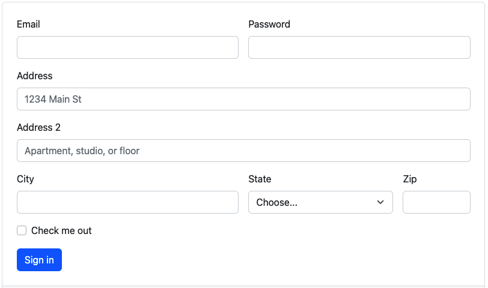

# Crear formulario in node js

```
🔥 Este ejercicio está diseñado para realizarse de 1 persona.
```

<p align="center">
  
</p>

Tecnologías: HTML, CSS, JS, Bootstrap, Node, express or express-generator.

Vamos a crear un formulario que se rederize desde node/express utilizando el manejado de templates de node `Embedded JavaScript templates`.
La idea es crear con Bootstrap renderizar los diferentes elementos dentro del diseñor y pasar los datos a mostrar dinamicamente, todos los elementos se deven cargar en una vista principal llamada home.ejs


## 🌱  Cómo iniciar este proyecto

a) Configura express desde cero.

b) Crear el proyecto usando express-generator.

💡 Importante: guardar tu código en tu nuevo repositorio usando `add`, `commit` y `push`.

## Estrategia

Tomate unos minutos para analizar 🤯 la imagen y dibuja tu estrategia sobre ella, identifica los componentes que vas a utilizar de bootstrap:

Una vez terminada la estrategia puedes empezar a codificar, 
¡Empieza a programar 🎊!
