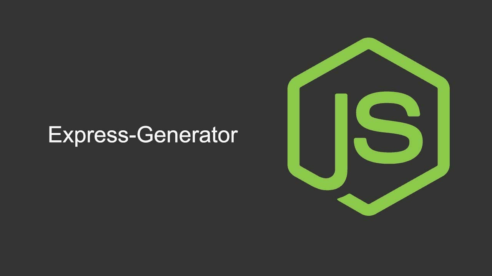

### ¿Qué es express generator?

El paquete express-generator ayuda muchísimo en el desarrollo de aplicaciones web con Node, pues genera la estructura de una aplicación. Una pequeña desventaja es que al generar el código no sabemos cómo cambiar algunas cosas muy básicas, por ejemplo, el puerto en el que escucha la app (por defecto es el puerto 3000).

### Instalar express generator

Para instalar express generator podemos ejecutar el siguiente comando.

```bash
$ npm i -g express-generator
```

### Iniciar un proyecto con express generator

Para iniciar un nuevo proyecto con express generator podemos ejecutar el siguiente comando, el cual nos generara una estructura de proyecto:

```bash
$ express --pug webapp
```

### Estructura de directorios de express generator

Al crear nuestra aplicación con express generator obtenemos la siguiente estructura de directorio, la cual contiene todos los archivos necesarios para iniciar el proyecto, usando como motor de plantillas pug. dentro de los otros motores de platillas tenemos ejs, hts

    - webapp
        - bin
        - public
        - routes
        - views
        - app.js
        - package.json

### Instalar dependencias 

Para instalar todas las dependencias básicas para el funcionamiento de nuestra web ingresamos al directorio principal y ejecutamos el siguiente comando:

```bash
$ npm install
```

### Iniciar nuestro sitio web de express generator

Para iniciar nuestro proyecto web debemos ejecutar el siguiente comando:

```bash
$ npm run start
```
