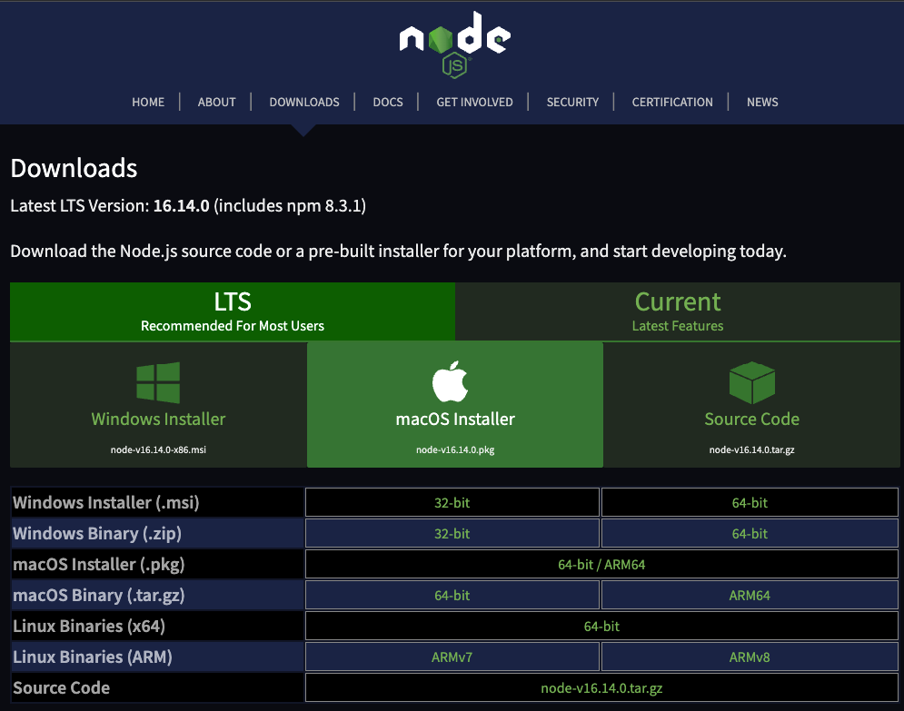
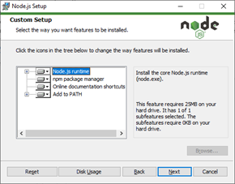

### Qué es NodeJS

Node.js es un entorno en tiempo de ejecución multiplataforma, de código abierto, para la capa del servidor (pero no limitándose a ello) basado en el lenguaje de programación JavaScript, asíncrono, con E/S de datos en una arquitectura orientada a eventos y basado en el motor V8 de Google. Fue creado con el enfoque de ser útil en la creación de programas de red altamente escalables, como por ejemplo, servidores web.4 Fue creado por Ryan Dahl en 2009 y su evolución está apadrinada por la empresa Joyent, que además tiene contratado a Dahl en plantilla.

Ejemplo

```python
    const http = require('http');

    const hostname = '127.0.0.1';
    const port = 1337;

    http.createServer((req, res) => {
        res.writeHead(200, { 'Content-Type': 'text/plain' });
        res.end('Hello World\n');
    }).listen(port, hostname, () => {
        console.log(`Server running at http://${hostname}:${port}/`);
    });
```

### Características de Node.js

Las siguientes son algunas de las características importantes que hacen de Node.js la primera opción para los arquitectos de software.

- Asíncrono y controlado por eventos: todas las API de la biblioteca Node.js son asíncronas, es decir, sin bloqueo. Esencialmente significa que un servidor basado en Node.js nunca espera que una API devuelva datos. El servidor pasa a la siguiente API después de llamarlo y un mecanismo de notificación de Events of Node.js ayuda al servidor a obtener una respuesta de la llamada API anterior.
- Muy rápido: al estar construido en el motor JavaScript V8 de Google Chrome, la biblioteca Node.js es muy rápida en la ejecución de código.
- Sin almacenamiento en búfer: las aplicaciones Node.js nunca almacenan en búfer ningún dato. Estas aplicaciones simplemente generan los datos en fragmentos.
- Procesos en un solo hilo pero altamente escalable: Node.js utiliza un modelo de una solo hilo con bucle de eventos. El mecanismo de eventos ayuda al servidor a responder sin bloqueos y hace que el servidor sea altamente escalable en comparación con los servidores tradicionales que crean hilos limitados para manejar las solicitudes. Node.js utiliza un solo programa de subprocesos y el mismo programa puede proporcionar servicio a un número mucho mayor de solicitudes que los servidores tradicionales como el Servidor Apache HTTP.
- Licencia basada en código abierto − Node.js se distribuye gracias a una licencia MIT.

### Caracteristicas para usar Node.js

1. Su ***velocidad***. Es bastante rápido en comparación con otras tecnologías similares.
2. Su ***adaptabilidad***. Está pensada para la web, pero es útil también para aplicaciones de consola, aplicaciones desktop, Robótica e Internet de las cosas. Casi no hay proyecto en el que no se pueda utilizar Node.js.
3. Su ***asincronismo***. Permite manejar múltiples peticiones en la web.
4. Su capacidad de ***comunicación en tiempo real***.
5. Su capacidad para integrarse a diferentes stacks (conjuntos de tecnologías). Como ejemplo, citamos el famoso stack ***MERN*** compuesto por Mongo.db, Node.js, Express.js (framework backend para Node) y React.js en el frontend. Se logra, así, un stack 100% ***Javascript*** y se unifican costos con un fullstack developer.

### Instalación de NodeJS

1. Entrar en https://nodejs.org/es/download/ y descargar el instalador de Node.js en el sistema operativo deseado. Podemos elegir entre Windows, Mac y Linux.



2. Ejecutar el instalador que acabamos de descargar. Simplemente debemos avanzar en el proceso de instalación. (no marcar la ultima opcion del instalador).


