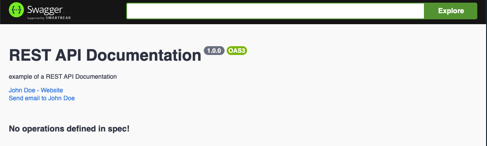
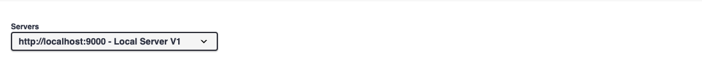
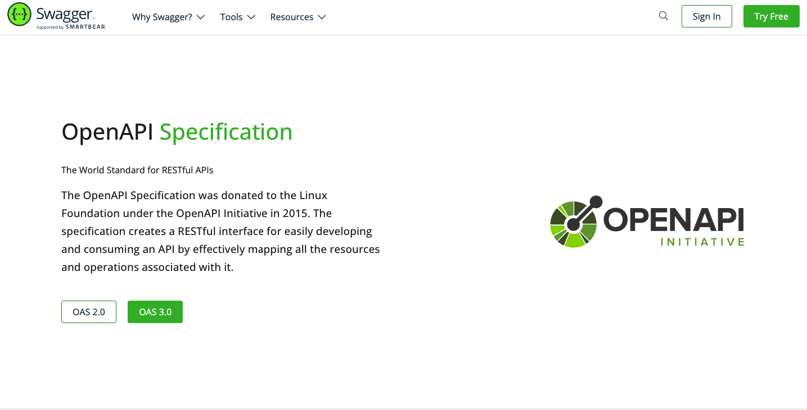

<p align="center">
    
</p>

# What is Swagger, and What is it for?

Swagger is an open specification to define the REST API. A Swagger document is the equivalent of the REST API of a WSDL document for a SOAP-based web service.

## What is the API documentation?

The API documentation, as its name says, covers the writing of informative content about the API's use. The guide is usually presented under a series of references and tutorials with examples that help developers understand the Application Programming Interface API.

## How to use Swagger

### Install Swagger

To install Swagger in our node project with express, we must use the following module

```bash
    $ npm i swagger-ui-express --save
```

Once installed, we have to configure our project by adding the following code to attach our swagger file:

```javascript
...
const swaggerUI = require('swagger-ui-express');
const swagggerDocument = require('./swagger.json');
...
```

After that, we will create a route for access to the documentation generated by swagger from the middleware:

```javascript
...
const options = {
    explorer: true
}
app.use('/docs', swaggerUI.serve, swaggerUI.setup(swaggerDocument, options));
...
```

Once our entire project has been configured to access our documentation with Swagger, we will proceed to configure our ***swagger.json*** file.

### Basic Information

This section contains the swagger specifications with the basic data of our project:

```json
{
    "openapi": "3.0.3",
    "info": {
        "title": "REST API Documentation",
        "description": "example of a REST API Documentation",
        "version": "1.0.0",
        "contact": {
            "name": "John Doe",
            "email": "john.doe@example.com",
            "url": "www.johndoe.com"
        }
    }
}

```

Result:

<p align="center">
    
</p>

### Servers

```json
{
    ...
    "servers": [
        {
            "url": "http://localhost:3000/v1",
            "description": "Local Server v1"
        }
    ],
    ...
}

```

Result:

<p align="center">
    
</p>

In order to keep configuring our ***swagger.json*** file, we can follow the specifications of the [OpenAPI](https://swagger.io/specification/) documentation in the "schema" section.


<p align="center">
    
</p>

